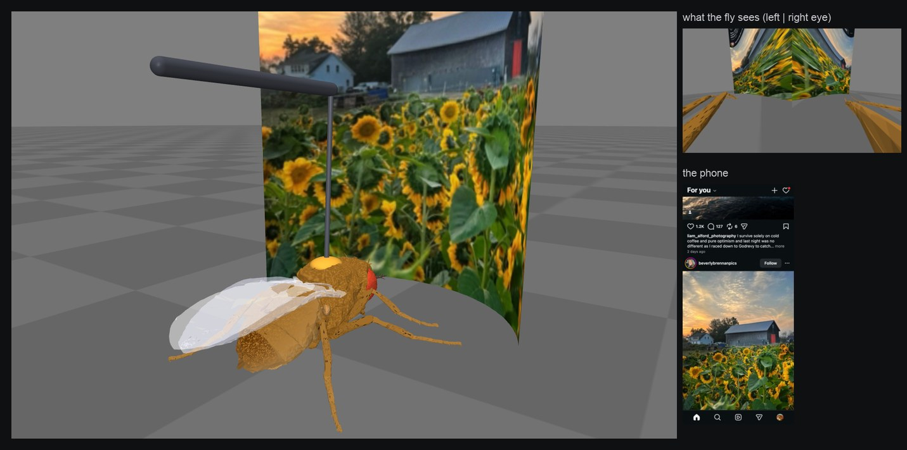

# flybrain

A fruit fly brain, simulated one neuron at a time, scrolling Instagram on its own.

The brain is built from the full wiring map of a male fruit fly, the MaleCNS v1.0 connectome from Janelia and Google. That's 165,122 neurons and about 6.2 million connections, covering the brain and the nerve cord. The brain drives a 3D fly body. The fly is glued to a pin in front of a phone, and the phone shows a real Instagram feed. What the fly's neurons do decides what happens on the account.



There's no language model and no trained network in the loop. Nobody tells the fly what to like. Every link between neurons and Instagram is a fixed table based on anatomy, and every one of them is written down in the docs.

## Seeing and smelling

The phone screen shows screenshots of the real feed, placed in a 3D scene. The fly looks at it through its own eyes: two cameras sit on its head, and each of the model's 7,378 visual neurons reads the image in the direction that neuron actually points. If the fly's head moves, what it sees moves too.

Captions are smells. Each word maps to a fixed smell, a mix of 3 of the fly's 53 smell receptor types, and the same word always smells the same. The fly has no idea what the words mean. "sunset" is just a smell to it.

The brain keeps running the whole time. It isn't reset between posts, so what it saw a few posts ago still shapes how it reacts now.

## What the body does on Instagram

The body is NeuroMechFly, simulated in MuJoCo. Motor neurons drive muscles, muscles move joints, and the joints report back to the brain. Nothing is animated or scripted.

The fly answers a post by moving part of its body:

| The fly... | Neurons | On Instagram |
|---|---|---|
| moves its legs to walk | leg motor neurons | scrolls to the next post |
| sticks out its proboscis (the mouth it eats with) | proboscis motor neurons | likes the post, or saves it if the reaction is strong |
| buzzes its wings (the courtship song) | wing motor neurons | writes a comment |
| curls its abdomen (what males do when trying to mate) | abdomen motor neurons | follows the account |
| tries to jump away | giant fiber and the jump muscle | nothing, it's tied down (see below) |
| grooms with its front legs, turns its head, backs up | leg, neck and walking-backward neurons | nothing yet |
| none of the above for 1.5 seconds | | gets bored and scrolls |

A move only counts if that body part actually moved in the 3D body. If the proboscis neurons fire but the proboscis doesn't visibly move, nothing happens.

The fly looks at each post in half-second steps, three at most. After each step, every muscle group's activity is compared with how that group usually reacts to a random post. The one that stands out the most wins. After a like, a comment or a follow, the feed moves on to the next post.

One thing is set by hand: how often each kind of reaction happens overall. For example, about 15% of posts get a proboscis reaction and about 2% get a comment. Which posts get them is up to the fly.

## Scared, but stuck

Some posts scare it. A dark shape growing on the screen or a sudden jump in brightness excites the looming-detector neurons (LC4), the same ones that make a real fly jump when a hand comes at it. They fire the giant fiber, and the giant fiber fires the jump muscle.

A free fly would jump and tumble over. This one is glued by its back to a thin pin, the way flies are held in lab experiments. It kicks its middle legs as hard as it can and goes nowhere. It can't leave the phone. The only way past a post it doesn't like is to scroll, and that has to come from its own legs.

## Comments

When the wings win, the fly writes its comment by sniffing. It smells candidate words one at a time, first from the caption in front of it and then from captions it saw earlier. For each word, the readout checks whether its legs push it toward the smell or away from it. It picks the word it likes most, then the next one. It stops when nothing pulls it anymore, or after four words.

Some comments it has written:

- "often", under a photo captioned "Often Overlooked". It went toward "often" and backed away from "overlooked".
- "our young this american"
- "cozy are soup getting"

## Watching it

Every session is recorded: every spike, the body, what the fly saw, and each decision with the numbers behind it. A local page plays it back. It shows the 3D fly, the whole nervous system with each neuron at its real position, the fly's own eye view, the phone, and a list of decisions. Clicking a decision shows which neurons led to it.

## Running it

You need Python 3.12 or 3.13.

```bash
python3.13 -m venv .venv
.venv/bin/pip install -e '.[dev]'
.venv/bin/python -m flybrain.connectome.download   # about 1.1 GB, goes to data/raw/
.venv/bin/python -m flybrain.connectome.build      # builds the cache in data/cache/
.venv/bin/python -m pytest
```

To try it without Instagram, with made-up posts:

```bash
.venv/bin/python -m flybrain.viz.session --posts 30 --out runs/test
.venv/bin/python -m flybrain.viz.serve runs/test    # open http://127.0.0.1:8765/
```

On Instagram, use a separate account. Automating Instagram is against its rules and the account can get restricted.

```bash
.venv/bin/python -m flybrain.insta.login                          # opens a browser, you log in yourself
.venv/bin/python -m flybrain.insta.session --posts 30             # dry run: the fly decides, nothing gets clicked
.venv/bin/python -m flybrain.insta.session --posts 30 --gercek    # the same, but its likes and comments really happen
```

`--izle` opens a live view at http://127.0.0.1:8766/. `--izin begen,yorum` turns off every action except likes and comments. The code never types, reads or stores your password. If Instagram shows a security check, the session stops and you solve it by hand.

To make a video from a recorded session:

```bash
.venv/bin/python -m flybrain.viz.video runs/<session>
```

## What isn't real (yet)

- The connectome shows which neurons connect and through how many synapses, but not how strong each synapse is. As in the whole-brain model of Shiu et al. (2024), every synapse gets the same weight. I had to lower that weight a bit and add short-term synapse fatigue, or the brain locks into a single state.
- There's no learning. The wiring never changes.
- Words are arbitrary smells. The fly doesn't understand language.
- The legs move, but the fly can't really walk yet. There's no coordinated gait.
- A free fly's own movement feeds back into its fear. Tied down, it gets scared less often. It also almost never curls its abdomen or turns its head, so follows are rare.
- It doesn't post its own photos yet, and the likes it gets don't reach its reward neurons yet.

## Docs

The docs and the day-by-day dev notes are in Turkish.

- [Principles](docs/01-vizyon-ve-ilkeler.md): what "the fly decides" means and where a human is involved
- [Architecture](docs/02-mimari.md), [Senses](docs/07-duyular.md), [Motor](docs/08-motor.md), [Body](docs/09-govde.md), [Instagram](docs/11-instagram.md)
- [Problems](docs/03-zorluklar.md): what went wrong and how it was fixed
- [Decisions](docs/kararlar.md): every design decision with its reasoning
- [Dev notes](docs/gunluk/)

## Data and license

The code is MIT ([LICENSE](LICENSE)). The connectome is MaleCNS v1.0 from Janelia FlyEM and Google, licensed [CC-BY 4.0](https://creativecommons.org/licenses/by/4.0/); see [sources](docs/kaynaklar.md). The body is simulated with [FlyGym / NeuroMechFly](https://github.com/NeLy-EPFL/flygym) (Apache-2.0).
