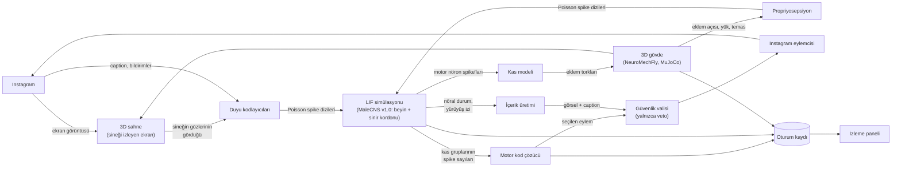

# 02 — Mimari

> Durum: **Faz 5 başında güncellendi (2026-09-17).** 3D gövde katmanı eklendi (K-019–K-021); ayrıntı: [09-govde.md](09-govde.md). Önceki güncelleme Faz 3 sonrası: Beyin ayarı K-011, duyu kodlaması K-012–K-014 ile belirlendi. Nöron havuzları MaleCNS anotasyon tablosunda doğrulandı (bkz. [05-veri-kesfi.md](05-veri-kesfi.md)); tek kaynak [`flybrain/anatomy.py`](../flybrain/anatomy.py). Havuzların *davranışsal* doğrulaması Faz 2 ve Faz 4'te yapıldı.

## Genel akış

## Bileşenler

| Modül | Görev |
|---|---|
| `flybrain/connectome/` | Veriyi indirir, nöronları filtreler, seyrek ağırlık matrisini ve işaretleri (uyarıcı/ketleyici) üretip önbelleğe alır |
| `flybrain/sim/` | Sızıntılı integrate-and-fire (LIF) simülasyon motoru |
| `flybrain/senses/` | Görme, koku ve ödül kodlayıcıları |
| `flybrain/motor/` | Motor nöron havuzlarının tanımı, kalibrasyon, eylem seçimi |
| `flybrain/body/` | 3D gövde: motor nöron → kas → eklem, propriyosepsiyon, sahne, kapalı döngü (Faz 5) |
| `flybrain/viz/` | Oturum kaydı (`record`), kayıttan yeniden çizim (`replay`), panel verisi (`export`), yerel panel (`serve`, `web/`), video (`video`) (Faz 6) |
| `flybrain/create/` | Post görseli ve caption üretimi |
| `flybrain/insta/` | Instagram bağlantısı: tarayıcı (`browser`), akış ve eylemler (`feed`), ekran kaynağı (`screen`), güvenlik valisi (`governor`), oturum (`session`) (Faz 8) |
| `flybrain/governor.py` | Hız sınırları ve içerik vetosu |
| `flybrain/journal/` | Her kararın gerekçesiyle birlikte kaydı |

## Beyin modeli

Temel olarak Shiu ve ark. (2024, *Nature*) çalışmasındaki tüm beyin LIF modelini kullanıyoruz. Model, sineğin besin tadına verdiği tepkileri başarıyla tahmin etmiş ve deneysel olarak doğrulanmış bir model.

| Parametre | Değer |
|---|---|
| Dinlenim potansiyeli | −52 mV |
| Ateşleme eşiği | −45 mV |
| Sıfırlama potansiyeli | −52 mV |
| Membran zaman sabiti | 20 ms |
| Sinaptik zaman sabiti | 5 ms |
| Refrakter süre | 2,2 ms |
| Sinaptik gecikme | 1,8 ms |
| Sinaps başına ağırlık | Shiu: 0,275 mV × sinaps sayısı. **Proje ayarı (K-011): 0,275 × 0,70 = 0,1925 mV** |
| İşaret | Nörotransmitter tahmininden: ACh → uyarıcı; GABA ve glutamat → ketleyici |
| Zaman adımı | 0,1 ms |
| Duyusal uyarım | Poisson; varsayılan 150 Hz, olay başına membran potansiyeline doğrudan +68,75 mV (0,275 × 250) |
| Bağlantı eşiği | En az 5 sinaps (K-009) |
| Kısa süreli sinaptik depresyon | **Proje ayarı (K-011):** U = 0,2, τ = 800 ms; duyu nöronları muaf. Shiu modelinde yok. |

Orijinal Shiu ayarıyla MaleCNS kalıcı bir çekiciye kilitlendiği için (Z-06) proje, kararlılık taramasıyla seçilen `BRAIN_PARAMS` ayarını kullanıyor. Ayrıntı: [06-simulasyon.md](06-simulasyon.md).

**Temel varsayım:** Konnektom sinaps *sayısını* verir, sinaps *gücünü* vermez. Bu yüzden her sinaps eşit ağırlıkta kabul edilir. Bu varsayımın zayıf yönleri için [03-zorluklar.md](03-zorluklar.md) belgesine bakın.

Neden MaleCNS kullanıyoruz? FlyWire (2024) yalnızca beyni kapsıyordu. MaleCNS ise **ventral sinir kordonunu** (omuriliğin sinekteki karşılığı) da içeriyor, yani bacak ve kanat motor nöronları da haritada. Ayrıca bir **erkek** sinek olduğu için kur yapma devreleri (P1, kur şarkısı) de mevcut. Bunları doğrudan "takip et" ve "yorum yap" eylemlerine bağlayabiliyoruz.

## Duyu kodlaması (Instagram → sinek)

| Instagram girdisi | Sinek duyusu | Hedef nöronlar (aday) | Kodlama |
|---|---|---|---|
| Post görseli | Görme | ON/OFF yolunun ilk uyarıcı nöronları: L2, L3 (karanlık), Mi1, Tm3 (aydınlık) | Görsel panoramik olarak iki gözün kolonlarına yayılır (K-014). Her kolonun kontrastı `(I − Ī)/Ī`, 0,6'da doyar ve en fazla 250 Hz'e dönüşür (K-012). Gri ekran sıfır uyarım demektir. Ayrıntı: [07-duyular.md](07-duyular.md) |
| Video / Reels | Hareket | Aynı nöronlar, zamansal dizi halinde | Kareler sırayla verilir; T4/T5 hareket algılama devreleri bu diziye doğal olarak tepki verir |
| Caption, hashtag, emoji | Koku | Koku alıcı nöronlar (ORN, 53 glomerül tipi) | Her kelime sabit bir özet fonksiyonuyla 3 glomerüle eşlenir; karışımda hız `200 · a/(a + 1/3)` Hz (K-013). Aynı kelime her zaman aynı "kokuyu" verir. |
| Kendi postuna gelen beğeni, yeni takipçi | Ödül | PAM dopamin nöronları | `150 · n/(n + 5)` Hz |
| Takipçi kaybı | Ceza | PPL1 dopamin nöronları | `150 · n/(n + 5)` Hz |

Fotoreseptörler ketleyici olduğu için görme girişi doğrudan ON/OFF yolunun uyarıcı nöronlarına veriliyor. Kodlayıcının sürdüğü nöronlar sinaptik depresyondan muaf. Bu düzende 16 doğal istatistikli görsel %95–100, görsel + caption olarak 16 post %85 doğrulukla inen nöronlarda ayırt ediliyor ve beyin her posttan sonra dinlenime dönüyor ([07-duyular.md](07-duyular.md)).

## Gövde (sinek → 3D dünya)

Sineğin gövdesi NeuroMechFly v2'dir: gerçek bir sineğin mikro-BT taramasından oluşturulmuş 3D model, MuJoCo fizik motoru ve 126 eklem serbestlik derecesi (K-019). Gövdeyi yalnızca simüle edilen motor nöronlar hareket ettirir:

1. **Motor nöron spike'ları:** Her motor nöron tipi, sürdüğü kas üzerinden bir eklem serbestlik derecesine ve yöne bağlıdır (anatomik tablo).
2. **Kas aktivasyonu:** Spike dizisi kas seğirmesi süresinde süzülür.
3. **Eklem torku → fizik:** Eklemlerin pasif yay ve sönümleyicileri gövdeyi motor girdi yokken duruşta tutar.
4. **Geri besleme:** Eklem açıları, yük ve zemin teması propriyoseptif duyu nöronlarına döner. Sineğin gözleri 3D sahnedeki Instagram ekranını görür.

Hazır yürüme programı, eğitilmiş kontrolcü ya da animasyon yoktur. Instagram eylemleri aşağıdaki nöral okumayla seçilmeye devam eder. Gövde aynı spike'larla hareket ettiği için ikisinin örtüşmesi ölçülür (K-020). Sahne: serbest sinek ve onu izleyen ekran (K-021). Ayrıntı: [09-govde.md](09-govde.md).

## Motor kod çözme (sinek → Instagram)

İlk tasarım literatürdeki komut nöronlarına dayanıyordu. Faz 4'te bunların çoğu gerçekçi postlarda sessiz kaldı (Z-19). Okuma artık **kas gruplarından** yapılıyor (K-015); ayrıntılar: [08-motor.md](08-motor.md).

| Instagram eylemi | Sinek davranışı | Kanal ve nöronlar |
|---|---|---|
| Sonraki posta geç | Yürüme | `ileri`: bacak motor nöronları (ön, orta, arka; 381) |
| Önceki posta dön | Geri yürüme | `geri`: MDN (4) |
| Beğen | Hortum hareketi, orta şiddet | `hortum`: beyin hortum motor nöronları (67) |
| Kaydet | Hortum hareketi, yüksek şiddet | `hortum`, ikinci ve daha yüksek eşik (K-018) |
| Yorum yap | Kanat titreşimi (kur şarkısı) | `yorum`: kanat yönlendirme motor nöronları (37; sıçrama kasları hariç, 2026-09-17) |
| Takip et | Karın bükme (kur yapmanın son aşaması) | `takip`: karın motor nöronları (214) (K-017) |
| Takipten çık / oturumu bitir | Kaçış, havalanma | `cikis`: alt tectulum'a inen nöronlar (31, Giant Fiber dahil) |
| Sekme değiştir (sol / sağ) | Baş çevirme | `sekme`: boyun motor nöronlarında sol − sağ farkı (44) |
| Boşta bekle | Ön bacakla temizlenme | `timar`: ön bacak hızı − diğer bacakların hızı |
| Bakmaya devam | — | Hiçbir kanal eşiğini aşmıyor |
| İlgisini kaybedip kaydır | — | 1,5 saniye içinde karar çıkmadı |

### Karar döngüsü (her post için)

1. **Kaydırma:** 300 ms gri ekran; önceki postun izi söner. Beyin durumu **sıfırlanmaz**.
2. **Uyarım:** görsel görme kodlayıcısına, caption koku kodlayıcısına, bildirimler ödül kodlayıcısına verilir.
3. **Bakış:** beyin 500 ms'lik pencerelerle, en fazla 3 pencere çalışır.
4. **Okuma:** her pencerede kanal hızları, referans postlara göre z-skora çevrilir.
5. **Seçim:** eşiğini (eylem bütçesinden gelir, K-016) en büyük farkla aşan kanalın eylemi seçilir. Hiçbiri aşmazsa bir pencere daha izlenir.
6. **İlgi kaybı:** 3 pencere sonunda karar yoksa sinek kaydırır.
7. **Uygulama:** seçilen eylem güvenlik valisinden geçer ve uygulanır. Her kararın z-skorları ve gerekçesi kaydedilir.

## İçerik üretimi

**Karar (K-004, K-005):** Görsellerde A ve B seçenekleri birlikte kullanılacak; bir post için hangisinin kullanılacağına sinek karar verecek. Caption'lar koku-kelime seçimiyle (A) yazılacak.

A/B seçimi için ilk öneri: post üretimi tetiklendiği anda motor aktivite baskınsa (sinek hareket halindeyse) yürüyüş resmi, merkezi beyin aktivitesi baskınsa (sinek "düşünüyorsa") nöral portre üretilir. Kesin kural Faz 9'da belirlenecek.

### Görsel

| Seçenek | Nasıl çalışır | Sineğin payı | Estetik |
|---|---|---|---|
| **A. Nöral portre** | O anki beyin aktivitesi, nöronların gerçek 3B konumları üzerinde görselleştirilir | %100 | Bilimsel görselleştirme havası |
| **B. Yürüyüş resmi** | Motor çıktı sanal bir tuvalde fırça gibi iz bırakır; renk o an hangi duyunun baskın olduğunu gösterir | %100 | Soyut, üslubu tutarlı |
| **C. Sinek güdümlü üretken model** | Motor çıktılar bir görsel üretim modelinin gizli uzayında yön seçer, görseli model çizer | Yön sinekten, çizim modelden | En "Instagram'lık" sonuç |

### Caption

| Seçenek | Nasıl çalışır | Sineğin payı | Okunabilirlik |
|---|---|---|---|
| **A. Koku-kelime seçimi** | Sinek feed'de karşılaştığı kelimelerden bir "koku kütüphanesi" oluşturur. Caption yazarken her aday kelimeyi sırayla koklar; en çok yaklaşma tepkisi veren kelime seçilir. Beyin durumu sıfırlanmadan sıradaki kelimeye geçilir. Kaçınma tepkisi baskın gelince caption biter. | %100 | Şiirsel kelime dizisi |
| **B. Kur şarkısı → Mors** | Nabız şarkısı nokta, sinüs şarkısı çizgi olarak okunur | %100 | Büyük olasılıkla anlamsız harfler |
| **C. Dil modeli** | Sineğin nöral durumu tarif edilir, metni model yazar | Düşük | Yüksek, fakat ilke 3'e aykırı |

### Paylaşım zamanı

P1 (kur uyarılması) aktivitesi oturum boyunca birikir. Belirli bir eşiği geçtiğinde sinek "bir şey söylemek ister" ve post üretimi başlar.

## Instagram bağlantısı

**Karar (K-006):** Playwright ile tarayıcı otomasyonu. Sinek, ekranda gördüğü görüntünün kendisini alır.

| Yol | Feed okuma | Beğeni/takip/yorum | Paylaşım | Risk |
|---|---|---|---|---|
| Resmi Instagram API | Yok | Yok (yalnızca kendi postlarındaki yorumlar) | Var (Business/Creator hesap) | Düşük |
| Tarayıcı otomasyonu (Playwright) | Var; sinek gerçekten ekranı "görür" | Var | Var | Orta: kullanım şartlarına aykırı, fakat insan hızında çalışılırsa fark edilmesi zor |
| Resmi olmayan mobil API (instagrapi) | Var | Var | Var | Yüksek: ban ve doğrulama isteği riski |

Resmi API tek başına yeterli değil, çünkü başkalarının postlarını okuyamıyor, beğenemiyor ve kimseyi takip edemiyor.

**Oturum güvenliği:** Instagram'a giriş kullanıcı tarafından tarayıcıda elle yapılır. Kod hiçbir zaman şifre görmez ya da saklamaz; yalnızca `browser-profile/` klasöründeki oturum kullanılır (bu klasör git'e girmez).
