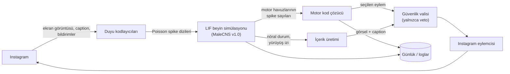

# 02 — Mimari

> Durum: **Faz 1 sonrası güncellendi.** Nöron havuzları MaleCNS anotasyon tablosunda doğrulandı (bkz. [05-veri-kesfi.md](05-veri-kesfi.md)); tek kaynak [`flybrain/anatomy.py`](../flybrain/anatomy.py). Havuzların *davranışsal* doğrulaması Faz 2 ve Faz 4'te yapılacak.

## Genel akış

## Bileşenler

| Modül | Görev |
|---|---|
| `flybrain/connectome/` | Veriyi indirir, nöronları filtreler, seyrek ağırlık matrisini ve işaretleri (uyarıcı/ketleyici) üretip önbelleğe alır |
| `flybrain/sim/` | Sızıntılı integrate-and-fire (LIF) simülasyon motoru |
| `flybrain/senses/` | Görme, koku ve ödül kodlayıcıları |
| `flybrain/motor/` | Motor nöron havuzlarının tanımı, kalibrasyon, eylem seçimi |
| `flybrain/create/` | Post görseli ve caption üretimi |
| `flybrain/instagram/` | Gerçek Instagram bağlantısı ve test için sahte (lokal) feed |
| `flybrain/governor.py` | Hız sınırları ve içerik vetosu |
| `flybrain/journal/` | Her kararın gerekçesiyle birlikte kaydı |

## Beyin modeli

Temel olarak Shiu ve ark. (2024, *Nature*) çalışmasındaki tüm beyin LIF modelini kullanıyoruz. Model, sineğin besin tadına verdiği tepkileri başarıyla tahmin etmiş ve deneysel olarak doğrulanmış bir model.

| Parametre | Değer |
|---|---|
| Dinlenim potansiyeli | −52 mV |
| Ateşleme eşiği | −45 mV |
| Sıfırlama potansiyeli | −52 mV |
| Membran zaman sabiti | 20 ms |
| Sinaptik zaman sabiti | 5 ms |
| Refrakter süre | 2,2 ms |
| Sinaptik gecikme | 1,8 ms |
| Sinaps başına ağırlık | 0,275 mV × sinaps sayısı |
| İşaret | Nörotransmitter tahmininden: ACh → uyarıcı; GABA ve glutamat → ketleyici |
| Zaman adımı | 0,1 ms |
| Duyusal uyarım | Poisson; varsayılan 150 Hz, olay başına membran potansiyeline doğrudan +68,75 mV (0,275 × 250) |
| Bağlantı eşiği | En az 5 sinaps (K-009) |

**Temel varsayım:** Konnektom sinaps *sayısını* verir, sinaps *gücünü* vermez. Bu yüzden her sinaps eşit ağırlıkta kabul edilir. Bu varsayımın zayıf yönleri için [03-zorluklar.md](03-zorluklar.md) belgesine bakın.

Neden MaleCNS kullanıyoruz? FlyWire (2024) yalnızca beyni kapsıyordu. MaleCNS ise **ventral sinir kordonunu** (omuriliğin sinekteki karşılığı) da içeriyor, yani bacak ve kanat motor nöronları da haritada. Ayrıca bir **erkek** sinek olduğu için kur yapma devreleri (P1, kur şarkısı) de mevcut. Bunları doğrudan "takip et" ve "yorum yap" eylemlerine bağlayabiliyoruz.

## Duyu kodlaması (Instagram → sinek)

| Instagram girdisi | Sinek duyusu | Hedef nöronlar (aday) | Kodlama |
|---|---|---|---|
| Post görseli | Görme | Fotoreseptörler: R1–R6 (parlaklık/hareket), R7 (UV), R8 (mavi/yeşil); kolon nöronları (L1–L5, Mi1...) | Görsel, veri setindeki `hex1 × hex2` kolon ızgarasına (göz başına yaklaşık 890 kolon) indirgenir. Fotoreseptörler ketleyici olduğundan giriş şekli Faz 3'te belirlenecek (bkz. Z-02). |
| Video / Reels | Hareket | Aynı nöronlar, zamansal dizi halinde | Kareler sırayla verilir; T4/T5 hareket algılama devreleri bu diziye doğal olarak tepki verir |
| Caption, hashtag | Koku | Koku alıcı nöronlar (ORN, 53 glomerül tipi) | Her kelime sabit bir hash fonksiyonuyla birkaç ORN türünün kombinasyonuna eşlenir. Böylece aynı kelime hep aynı "kokuyu" verir ve sinek kelimelere karşı tutarlı tepkiler geliştirebilir. |
| Kendi postuna gelen beğeni, yeni takipçi | Ödül | PAM dopamin nöronları | Bildirim sayısıyla orantılı uyarım |
| Takipçi kaybı | Ceza | PPL1 dopamin nöronları | Kayıp sayısıyla orantılı uyarım |

Bir not: gerçek sinekte görme sinyali fotoreseptörlerden merkezi beyne ulaşana kadar birçok katmandan geçer. Sinyal bu katmanlarda sönebilir ya da kontrolden çıkıp patlayabilir. Faz 3'ün ana riski bu.

## Motor kod çözme (sinek → Instagram)

| Instagram eylemi | Sinek davranışı | Nöron havuzu (MaleCNS tip adı) | Gerekçe |
|---|---|---|---|
| Sonraki posta geç | İleri yürüme | `ileri_yuru`: DNp09, DNg97 (= oDN1) | İleri yürümeyi başlatan inen nöronlar (Bidaye ve ark. 2020) |
| Önceki posta dön | Geri yürüme | `geri_yuru`: MDN (= DNp50) | Geri yürüme komut nöronu (Bidaye ve ark. 2014) |
| Postta kalmaya devam et | Durma | Havuzların hiçbiri eşiği aşmıyor | Sinek karar verene kadar bakmayı sürdürür, yani bakma süresini de sinek belirler |
| Beğen | Hortum uzatma (beslenme) | `hortum`: MN9 | Shiu ve ark. modelinin doğrulanmış çıktısı |
| Kaydet | Beslenmeyi sürdürme (yutma) | Faringeal motor nöronlar (açık soru) | Faz 4'te kararlaştırılacak |
| Yorum yap | Kur şarkısı (kanat titreşimi) | `sarki`: pIP10, vPR6 | Erkeğe özgü "seslenme" davranışı |
| Takip et | Kur başlatma | `kur`: pC1_* (fru+dsx yüksek; P1 soyu) | Erkek sinek kur yaparken dişiyi gerçekten *takip eder* |
| Takipten çık / oturumu bitir | Kaçış (sıçrayıp uçma) | `kacis`: DNp01 (Giant Fiber) | Ani kaçış refleksi |
| Sekme değiştir (akış / keşfet / reels) | Sola/sağa dönme | `don_sol` / `don_sag`: DNa02 L / R | Dönme komut nöronu (Rayshubskiy ve ark. 2020) |
| Boşta bekle | Tımar (temizlenme) | `timar`: DNg62 (= aDN1), DNge078 (= aDN2) | Anten temizleme devresi (Hampel ve ark. 2015) |

### Karar döngüsü (her post için)

1. Post ekrana gelir, ekran görüntüsü alınır, caption okunur.
2. Görsel görme kodlayıcısına, caption koku kodlayıcısına verilir.
3. Beyin bir **karar penceresi** boyunca simüle edilir (başlangıç değeri: 500 ms simülasyon zamanı).
4. Her motor havuzunun ateşleme hızı, kalibrasyonla belirlenen eşiğiyle karşılaştırılır.
5. Eşiği en büyük oranla aşan havuzun eylemi seçilir. Hiçbir havuz eşiği aşmazsa bir pencere daha simüle edilir (sinek bakmaya devam eder).
6. Seçilen eylem güvenlik valisinden geçer ve uygulanır. Beyin durumu **sıfırlanmaz**; bir önceki postun izi sonraki kararı etkiler.

## İçerik üretimi

**Karar (K-004, K-005):** Görsellerde A ve B seçenekleri birlikte kullanılacak; bir post için hangisinin kullanılacağına sinek karar verecek. Caption'lar koku-kelime seçimiyle (A) yazılacak.

A/B seçimi için ilk öneri: post üretimi tetiklendiği anda motor aktivite baskınsa (sinek hareket halindeyse) yürüyüş resmi, merkezi beyin aktivitesi baskınsa (sinek "düşünüyorsa") nöral portre üretilir. Kesin kural Faz 7'de belirlenecek.

### Görsel

| Seçenek | Nasıl çalışır | Sineğin payı | Estetik |
|---|---|---|---|
| **A. Nöral portre** | O anki beyin aktivitesi, nöronların gerçek 3B konumları üzerinde görselleştirilir | %100 | Bilimsel görselleştirme havası |
| **B. Yürüyüş resmi** | Motor çıktı sanal bir tuvalde fırça gibi iz bırakır; renk o an hangi duyunun baskın olduğunu gösterir | %100 | Soyut, üslubu tutarlı |
| **C. Sinek güdümlü üretken model** | Motor çıktılar bir görsel üretim modelinin gizli uzayında yön seçer, görseli model çizer | Yön sinekten, çizim modelden | En "Instagram'lık" sonuç |

### Caption

| Seçenek | Nasıl çalışır | Sineğin payı | Okunabilirlik |
|---|---|---|---|
| **A. Koku-kelime seçimi** | Sinek feed'de karşılaştığı kelimelerden bir "koku kütüphanesi" oluşturur. Caption yazarken her aday kelimeyi sırayla koklar; en çok yaklaşma tepkisi veren kelime seçilir. Beyin durumu sıfırlanmadan sıradaki kelimeye geçilir. Kaçınma tepkisi baskın gelince caption biter. | %100 | Şiirsel kelime dizisi |
| **B. Kur şarkısı → Mors** | Nabız şarkısı nokta, sinüs şarkısı çizgi olarak okunur | %100 | Büyük olasılıkla anlamsız harfler |
| **C. Dil modeli** | Sineğin nöral durumu tarif edilir, metni model yazar | Düşük | Yüksek, fakat ilke 3'e aykırı |

### Paylaşım zamanı

P1 (kur uyarılması) aktivitesi oturum boyunca birikir. Belirli bir eşiği geçtiğinde sinek "bir şey söylemek ister" ve post üretimi başlar.

## Instagram bağlantısı

**Karar (K-006):** Playwright ile tarayıcı otomasyonu. Sinek, ekranda gördüğü görüntünün kendisini alır.

| Yol | Feed okuma | Beğeni/takip/yorum | Paylaşım | Risk |
|---|---|---|---|---|
| Resmi Instagram API | Yok | Yok (yalnızca kendi postlarındaki yorumlar) | Var (Business/Creator hesap) | Düşük |
| Tarayıcı otomasyonu (Playwright) | Var; sinek gerçekten ekranı "görür" | Var | Var | Orta: kullanım şartlarına aykırı, fakat insan hızında çalışılırsa fark edilmesi zor |
| Resmi olmayan mobil API (instagrapi) | Var | Var | Var | Yüksek: ban ve doğrulama isteği riski |

Resmi API tek başına yeterli değil, çünkü başkalarının postlarını okuyamıyor, beğenemiyor ve kimseyi takip edemiyor.

**Oturum güvenliği:** Instagram'a giriş kullanıcı tarafından tarayıcıda elle yapılır. Kod hiçbir zaman şifre görmez ya da saklamaz; yalnızca `browser-profile/` klasöründeki oturum kullanılır (bu klasör git'e girmez).
